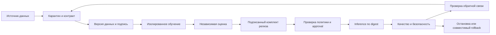

# Trusted MLSecOps Platform

Исследование и реализация воспроизводимого жизненного цикла машинного обучения с контролями безопасности.

**Статус: R1 в разработке, первый рабочий developer preview.** Уже доступны синтетические данные, подписанные manifests, контейнерное обучение, ONNX-предсказания и отдельный scorer с подписанным evaluation report. Полная приёмка M01-M23 пока не пройдена: preview не является trusted release или production-платформой. Исследование: 2026-10-06; начало реализации: **2026-10-07**.

## Запустить рабочий пример

Требуются Git, uv и Docker Engine с Linux x86_64 containers. Bootstrap требует Python 3.12, Docker с минимум 2 CPU/6 GiB общей памяти и 8 GiB свободного диска. Свободную RAM для worker с лимитом 4 GiB проверяйте отдельно: capacity не означает доступный headroom. На Windows подходит Docker Desktop/WSL2 (Windows Subsystem for Linux 2).

```bash
git clone https://github.com/Abrakadabra124/trusted-mlsecops-platform.git
cd trusted-mlsecops-platform
uv sync --locked --python 3.12.15
uv run --locked python -m mlsecops build
uv run --locked python -m mlsecops demo
uv run --locked python -m mlsecops.qualification
```

Первая установка/сборка использует сеть; training/prediction workers работают без сети, host mounts и ключей. Состояние, модели и ключи сохраняются только в игнорируемой `.runtime/`. Повторный bootstrap сохраняет identities, обучение создаёт новый run. Demo выводит метрики и явно указывает `unapproved`; оно не меняет исходную DevSecOps-платформу.

Qualification запускает отрицательные сценарии и три fresh-process обучения. Полный отчёт: `.runtime/evidence/developer-qualification.json`. CLI приёмки для ещё не реализованных полных gates возвращает `inconclusive`, exit code 2. [Подробности реализации и ограничения](docs/implementation.md).

Постановка эксперимента: [dataset card](docs/dataset-card.md), [model card](docs/model-card.md). Метрики и ограничения должны читаться вместе.

## Зачем нужен проект

MLSecOps (Machine Learning Security Operations) в этом проекте означает включение безопасности в сбор данных, обучение, оценку, выпуск и эксплуатацию ML-системы. Это не просто применение искусственного интеллекта для поиска атак: защищается сама система машинного обучения.

Цель - уметь доказать, из каких данных и каким процессом получена модель, кто разрешил её выпуск, что именно работает сейчас и как безопасно остановить или откатить систему. Подписи и хеши дополняются независимой оценкой поведения: корректно подписанная модель всё равно может быть плохой или отравленной.

Исходная платформа: [enterprise-devsecops-platform](https://github.com/Abrakadabra124/enterprise-devsecops-platform). Её код и исторические доказательства проверены read-only; действующая инфраструктура в рамках исследования не менялась.

## С чего начать

| Вопрос | Документ |
| --- | --- |
| Какой результат строим и что считаем успехом? | [Цель и границы](GOAL.md) |
| Что такое MLSecOps и какие выводы дали источники? | [Исследование](docs/research.md) |
| Что изменилось в мировых практиках и что применимо к нам? | [Международный обзор 2026-10](docs/global-research-2026-10.md) |
| Какие рекомендации из CyberOrda и нового текста обоснованы? | [Критический разбор](docs/material-review.md) |
| Как исследование меняет требования проекта? | [8 решений и их проверяемые связи](docs/practice-adoption.md) |
| Как использованы PDF, схема и статья PT? | [Разбор материалов](docs/provided-materials.md) |
| Что уже есть в текущей платформе? | [Baseline и gap analysis](docs/baseline-gap.md) |
| Как выглядит продукт и путь пользователя? | [Карта продукта](docs/product-map.md) |
| Как соединены компоненты и границы доверия? | [Архитектура](docs/architecture.md) |
| От чего защищаемся и что останется риском? | [Модель угроз](docs/threat-model.md) |
| Какие инструменты нужны и почему не все сразу? | [Выбор технологий](docs/technology-decisions.md) |
| Какие измерения докажут работоспособность? | [23 критерия приёмки](docs/acceptance.md) |
| В каком порядке реализовывать? | [14-16 недель плюс резерв](tasks/plan.md), [29 задач](tasks/todo.md) |
| Что делать при отказе или компрометации? | [Проект эксплуатационных процедур](docs/runbooks.md) |
| Что проверено сейчас? | [Статус и пределы доказательств](STATUS.md) |
| Где первоисточники и определения? | [Реестр источников](docs/sources.md), [словарь](docs/glossary.md) |
| Что изменилось между редакциями? | [История изменений](CHANGELOG.md) |

## Целевая цепочка



ML-сценарий - **Release Risk Advisor**, консультативная оценка риска релиза. В preview используются только синтетические нормированные признаки. ML не разрешает публикацию и не отменяет детерминированные security gates. Работа с реальными метаданными CI остаётся будущим пилотом, а не существующей бизнес-системой.

Для проверки механики сначала используются синтетические данные. Их метрики не доказывают пользу на реальных релизах. Реальные данные, разметка, допустимые ошибки и их владельцы должны быть согласованы до пилота.

## Проверка этого репозитория

Требуется только Python 3.12 или новее, без сторонних пакетов:

```bash
python scripts/check_docs.py
```

Проверяются локальные Markdown-ссылки и якоря, обязательные документы, идентификаторы критериев/задач/источников и правила публикации. Дополнительно проверяется [машиночитаемый реестр решений](docs/research-decisions.json): известные источники, gates/tasks, существующие артефакты, owner, ограничения и research-only статус. GitHub Actions выполняет ту же команду. **Зелёный документационный CI не означает прохождение ML-приёмки.** Валидатор не проверяет истинность научных выводов, доступность внешних сайтов, криптографию или модель.

## Что добавило исследование R0.2

Изучены материалы Google, Microsoft, AWS, Anthropic, NVIDIA, OpenAI, Databricks и Hugging Face, а также отраслевые первоисточники. Реестр содержит 44 записи, включая предоставленные материалы и baseline evidence, не 44 независимых эксперимента. Это качественный обзор выбранных публикаций, не статистика всего рынка.

В design добавлены inventory graph с транзитивным отзывом, раздельные worker/controller полномочия, проверяемое покрытие artifact scanning, абсолютные poisoning budgets с независимыми challenges и security-event replay. ML/LLM output никогда не становится разрешением privileged action. Полное внедрение ещё впереди; начатый developer preview не закрывает все design decisions автоматически.

## Условия реализации

- Не переносить production-данные, секреты, приватные модели или персональные сведения в этот публичный репозиторий.
- Начать с совместимости, ресурсов и P0-долгов исходной платформы, а не с установки всего ML-стека.
- Версии и digest зависимостей выбирать на этапе реализации после проверки совместимости и уязвимостей. Документация `latest` не является lock-файлом.
- У каждой будущей проверки должны быть отрицательный сценарий, машинный результат, commit/digest входов и ограничения.
- «Доверенная» означает проверенные свойства в определённой модели угроз, а не обещание абсолютной безопасности или сертификации.

PDF пользователя и исходная иллюстрация не переопубликованы. Ссылки, атрибуция и ограничения использования приведены в [разборе материалов](docs/provided-materials.md). Mermaid-схемы здесь являются оригинальной архитектурой предлагаемого проекта.
