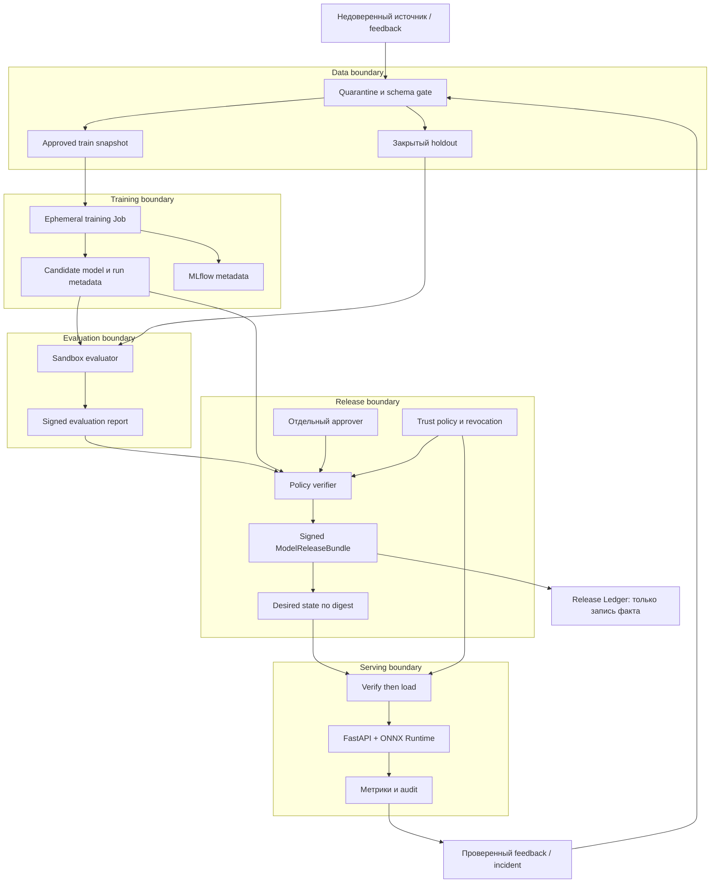
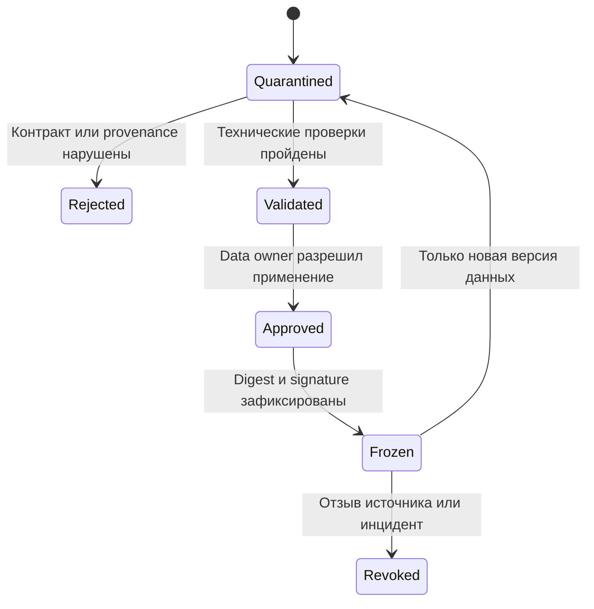

# Целевая архитектура

**Design proposal, не deployed state.** Решение ограничено первым табличным CPU-сценарием. Базовые допущения: [GOAL](../GOAL.md), решения: [technology decisions](technology-decisions.md).

## 1. Компоненты и границы доверия

Стрелка обозначает разрешённый интерфейс, а не широкую сетевую связность. Jobs не получают общий S3 root key. Namespaces не являются самостоятельной security boundary без RBAC, network policy, storage isolation и тестов запрета.

## 2. Хранение и идентичности

Предлагаемые классы объектов: `quarantine`, `approved-train`, `holdout`, `candidates`, `evaluations`, `releases`, `audit`. Разные credentials и доступы, не только названия каталогов. Для локального стенда допускается изолированный filesystem/PVC с read-only mount и проверкой digest. Он не объявляется WORM-хранилищем или защитой от host-admin. Выбор поддерживаемого S3-compatible backend фиксируется в T02 после лицензионной и security-проверки.

| Identity | Читать | Писать | Явно запрещено |
| --- | --- | --- | --- |
| ingestor | Только разрешённый источник | Quarantine | Approved, releases, signer |
| curator | Quarantine, schema, provenance | Новый approved snapshot; разделение split | Promotion модели |
| trainer | Approved train/validation, pinned deps | Candidates, собственные runs | Holdout labels, releases, ключи, production API |
| evaluator | Candidate и holdout | Evaluation reports | Изменение train/model, promotion |
| promoter | Reports, bundle candidates, trust policy | Release envelope, GitOps proposal | Обучение и редактирование holdout |
| serving | Один approved release и актуальная trust policy | Только ограниченная telemetry | Candidate storage, training data, registry write |
| operator | Статус, разрешённые recovery interfaces | Incident actions по роли | Неаудируемый обход verification |

Ключи signer и evaluator не монтируются в trainer. В production - короткоживущая workload identity и отдельный KMS; в lab - раздельные локальные ключи с явным ограничением доверия к host. Подпись job не делает job добросовестным: exporter provenance должен быть защищён от изменения самой training job.

## 3. Dataset contract и жизненный цикл данных

Планируемый manifest содержит: `schema_version`, `dataset_id`, список объектов с SHA-256 и размером, источник и разрешение, schema digest, transform commit, split manifest digest, seed, порядок строк, число строк/классов, label provenance, identity curator, timestamp, retention classification. Подпись хранится отдельно и покрывает точные manifest bytes.

Одобренная версия не изменяется in-place. На чтении заново проверяются bytes, размер и разрешённый тип. Пути запрещают traversal/symlink escape; dataset архивы не распаковываются произвольным способом. Ошибка чтения, неполная версия или отсутствующий source approval дают отказ, а не скачивание `latest`.

Split выбирается по времени/группе релизов, а не случайным перемешиванием зависимых событий. Preprocessing обучается только на train. Идентификаторы одной сущности не должны пересекать train/validation/final holdout. Финальный holdout недоступен trainer; источники этого набора и разметки не контролируются тем же attacker в основном профиле.

## 4. Обучение и оценка

1. Orchestrator проверяет approved dataset, pinned code/image и разрешённые параметры.
2. Создаёт ephemeral Job с ресурсными лимитами, readonly root, seccomp, non-root и deny-by-default egress. Зависимости заранее собраны в image, online `pip install` внутри training запрещён.
3. Job обучает preprocessing + Logistic Regression, экспортирует ONNX и пишет candidate. Не может повысить candidate до release.
4. Доверенный wrapper фиксирует входные digest и окружение; MLflow получает run metadata. Произвольные HTML/модельные загрузчики не открываются автоматически в привилегированном контуре.
5. Evaluator проверяет структуру ONNX в отдельном ограниченном процессе, затем измеряет clean/slice/parity/robustness на разрешённых наборах.
6. Report содержит все результаты, ограничения и policy digest; отсутствие теста или малый sample size дают `inconclusive`, не `pass`.

Повторный запуск с теми же inputs создаёт отдельный run, но не перезаписывает approved artifacts. Идемпотентный promotion использует `(bundle_digest, environment, policy_digest)`; повтор не меняет state и не создаёт новый неаудируемый approval.

## 5. ModelReleaseBundle: единица доверия

Это **предлагаемый проектный контракт**, не готовый industry standard. Version 1 должен связать:

| Группа | Обязательные поля |
| --- | --- |
| Идентичность | schema_version, release_id, intended_use, owner |
| Материалы | model_sha256, preprocessing_sha256, feature_contract_sha256, dataset_manifest_sha256, split_manifest_sha256 |
| Процесс | source_commit, train_image_digest, dependency_lock_sha256, parameters_sha256, seed, compute_profile, provenance_sha256 |
| Проверка | evaluation_report_sha256, evaluator_identity, evaluation_policy_sha256, model_card_sha256, ML-BOM digest |
| Эксплуатация | serving_image_digest, API contract version, compatibility_group, resource_profile, expires_at |
| Доверие | signer identity, policy version, release sequence, signature envelope |

Manifest digest вычисляется по точным сериализованным bytes с однозначным UTF-8 JSON-профилем и запретом duplicate keys, NaN, неоднозначных числовых форм. Envelope signatures и approvals **не включаются в собственный подписываемый digest**. Отдельный approval связывает bundle digest, environment, policy digest, approver и expiry. Формат и parser round-trip фиксируются до реализации; конкатенация непроверенных строк не заменяет стандартную подпись.

Preprocessing включается в ONNX-граф, где возможно. Если часть остаётся вне графа, её digest и compatibility contract обязательны. Модель и признаки не обновляются независимо.

SBOM описывает ПО, ML-BOM - модель/данные, provenance - процесс происхождения. Перечень файлов не заменяет соответствие всех actual bytes указанным digest. Связь отчёта с candidate проверяется повторно, чтобы хороший report нельзя было прикрепить к другой модели.

## 6. Promotion и загрузка

Promotion policy проверяет signature и разрешённого signer, отсутствие revocation, срок действия, policy version, все digests, независимый evaluation, обязательные gates и явный approval. Неизвестный schema version отклоняется. MLflow alias `champion` или строка в Release Ledger недостаточны.

Сначала blob хранится под content address, затем подписанный desired state указывает этот digest. Model loader скачивает в новый закрытый путь, проверяет размер/digest/envelope/approval и загружает **те же bytes**, не повторно разрешает изменяемый URL. Загрузка происходит в sandbox до готовности новой replica. Нельзя получать произвольный URL из inference-запроса: это создало бы SSRF и обход политики источников.

Serving никогда не получает signing key. На старте и периодически он проверяет актуальность release authorization. Для lab предлагается trust lease 60 s: если актуальную policy получить нельзя, после lease ML-путь прекращает обслуживать запросы. При known revocation - немедленно по получении события. Это осознанный компромисс доступности ради bounded stale trust.

Rollback допускает меньший release sequence только через **новое** rollback approval, которое указывает текущий и целевой digest, причину и действующую policy. Оно не восстанавливает доверие к отозванному signer/модели. Защита от replay не должна случайно запрещать разрешённое восстановление.

## 7. Контракт inference

Предлагается `POST /v1/predict`: именованные конечные числовые/категориальные признаки по версии схемы, до 100 строк, body до 64 KiB, без произвольных файлов и URL. Возврат: request ID, advisory score в `[0,1]`, decision=`advisory|abstain`, bundle digest, schema version, reason code. Финальный набор полей определяется T03/T15.

- Неверная схема/NaN/неизвестные обязательные категории: 422, oversized body: 413, превышение квоты: 429.
- Нет доверенной модели/истёк trust lease: 503, никакой загрузки случайного fallback.
- Данные вне заявленного диапазона: `abstain` с ограниченным reason code; это не универсальный OOD-detector.
- Время и память ограничены; timeout не должен оставлять бесконечный вычислительный процесс.
- Логи не содержат исходные features или labels; trace связывает request с digest и решением gate.

## 8. Наблюдение, восстановление и production delta

Три слоя наблюдения: инфраструктура/API, данные/качество модели, доверие/безопасность. Drift - повод проверить данные и labels; integrity failure - security incident с остановкой затронутого пути. Алерты и откат не должны зависеть от того же скомпрометированного training account.

Backup должен включать совместимые snapshots metadata и artifact references, approved datasets, bundles, policy и approvals. Private keys восстанавливаются отдельной защищённой процедурой. После restore проверяются ссылки и digest, затем пробные predictions; один успешный SQL restore не завершает ML recovery.

Production отличается от lab не именем namespace: нужны TLS, отдельный identity provider, KMS, внешняя копия, HA, capacity planning, контроль administrators, retention/удаление данных, on-call, независимый review и утверждённые бизнес-риски. Переход описан в [плане](../tasks/plan.md), процедуры - в [runbooks](runbooks.md).
