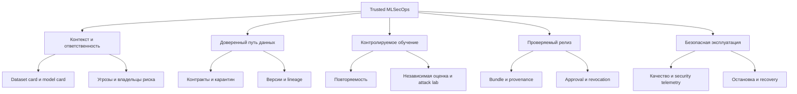
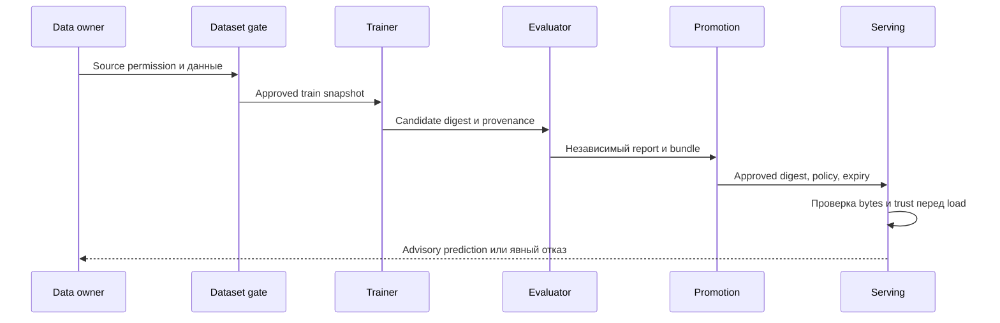

# Карта продукта

Статус: **проектное предложение**. Термины раскрыты в [словаре](glossary.md). Функции ниже не являются перечнем уже установленного ПО.

## Пользователи и результаты

| Роль | Задача пользователя | Результат продукта |
| --- | --- | --- |
| Data owner / curator | Разрешить использование конкретных данных | Passport, проверенный dataset manifest, provenance разметки |
| ML engineer | Обучить и сравнить воспроизводимые candidates | Run с входными digest, метриками и model card |
| Security reviewer | Проверить атаки и полномочия | Threat/evaluation reports, решения по риску |
| Release approver | Выпустить только проверенный комплект | Approval, привязанный к bundle/policy/environment |
| Platform/SRE engineer | Наблюдать, ограничивать и восстанавливать | SLO, alerts, совместимый rollback, DR evidence |
| Reviewer портфолио | Повторить демонстрацию и проверить утверждения | Readme, команды, pinned inputs, redacted evidence |

В первом стенде роли могут исполняться одним человеком, но credentials и полномочия должны быть раздельными. Независимость людей не заявляется там, где её нет.

## Дерево возможностей

## Один вертикальный сценарий

**Release Risk Advisor** принимает строго определённые признаки, доступные до релиза: агрегированные изменения, длительность/стабильность разрешённых CI-проверок и исторические данные в допустимом окне. Возвращает advisory risk score и версию использованного bundle.

Нельзя передавать в features будущий результат релиза, факт последующего rollback или метрику, вычисленную после момента решения. Такой leakage даст красивые offline-метрики без полезного предсказания. Не использовать имена разработчиков, содержимое секретов, исходный код приватных проектов и свободный текст логов в первом профиле.

Начальная модель: Logistic Regression с фиксированным preprocessing и ONNX export. Простая модель позволяет увидеть проблему данных и изоляции без GPU. Если она не выигрывает у правил на настоящем holdout, не усложнять модель автоматически: проверить постановку и качество label.

## Этапы зрелости продукта

| Этап | Что доступно | Условие выхода |
| --- | --- | --- |
| R0 Research | Этот репозиторий: исследование и design | Документы связаны, опубликованы, границы честно указаны |
| R1 Local reference | Синтетический end-to-end путь, изоляция и ML-gates | M01-M18 на лабораторном CPU-профиле |
| R2 Controlled pilot | Разрешённые реальные данные, shadow/advisory режим | Data owner, значимая utility, независимый review, production prerequisites |
| R3 Production profile | HA, OIDC/KMS, TLS, offsite DR, on-call | Отдельная приёмка по инфраструктуре и требованиям владельца |
| R4 Extensions | Другие модели, команды, GPU или GenAI | Новая модель угроз и измеренная необходимость каждого расширения |

## Метрики продукта, не только технологии

- Доля попыток выпуска без полной цепочки evidence, которые были заблокированы.
- Время объяснения «почему работает именно эта модель» по одному release ID.
- Время восстановления и доля успешно пройденных регулярных negative tests.
- Число моделей с актуальными owner, intended use, expiry и совместимым rollback.
- Для реального пилота: precision/recall или ожидаемая стоимость ошибок против простого правила при фиксированном бюджете ручной проверки.

Измерения пользы и удобства пока не проведены. Обнаружение неизвестного poisoning нельзя достоверно выразить одной долей без известного распределения атак.
