# План перехода DevSecOps -> MLSecOps

## Как читать план

Это план **реализации**, не отчёт о завершённых неделях. R0.2 завершён, с 2026-10-07 начат R1: локальный reference с [M01-M23](../docs/acceptance.md) и 29 задачами. Уже есть developer preview, но полная приёмка не пройдена; актуальные результаты в [STATUS](../STATUS.md). Плановый ориентир сохраняется: 14-16 недель активной работы при 15-20 часах в неделю, плюс 25% календарного резерва, примерно 18-20 недель всего. Это оценка, не обещание даты; discovery, реальные данные и production-профиль могут увеличить срок. T25-T29 добавляют ориентировочно 30-50 часов к исходному scope.

Зависимости важнее даты: если gate не принят, следующая неделя не превращает результат в готовый автоматически. Одна рабочая итерация: требование -> отрицательный тест -> реализация -> проверка конечного состояния -> очищенное evidence -> review -> commit. Не менять действующую foundation вслепую.

## Карта зависимостей

```mermaid
flowchart LR
    W1[1: Scope и foundation] --> W2[2: Данные]
    W2 --> W3[3: Изоляция]
    W3 --> W4[4: Воспроизводимость]
    W4 --> W5[5: Независимая оценка]
    W5 --> W6[6: Attack lab]
    W6 --> W7[7: Intake и challenges]
    W7 --> W8[8: Trust и inventory]
    W8 --> W9[9: Serving]
    W9 --> W10[10: Наблюдение]
    W10 --> W11[11: Security events]
    W11 --> W12[12: Rollback и restore]
    W12 --> W13[13: Полная приёмка]
    W13 --> W14[14: Review и release]
```

## Неделя 1: Контекст и foundation

**Задачи:** T01, T02. Уточнить utility target, label horizon, владельца данных и профиль угроз. Инвентаризировать ОС/WSL/Docker/CPU/RAM/disk, прочитать текущие ограничения registry и подписей. Проверить foundation в отдельном окружении, совместимость ML-пакетов, источники и лицензии. Создать общий acceptance runner и inventory без production credentials.

**Результат:** versioned scope, resource/compatibility matrix, pinned foundation reference, P0 backlog с разрешённым путём устранения, bootstrap idempotency evidence. **Приёмка:** M01. **Почему сначала:** несовместимая база и общий signing key обесценят последующие ML-gates.

## Неделя 2: Контракт данных и происхождение

**Задачи:** T03, T04. Создать синтетический generator, data dictionary и dataset card; определить temporal/group split для реального профиля. Реализовать quarantine, schema/range/duplicate checks, DVC tracking и отдельный подписанный SHA-256 manifest. Пройти tamper/path/permission negative tests.

**Результат:** approved immutable dataset + split, повторяемая подготовка, отчёт отказов. **Приёмка:** M02, M03. **Зависимость:** согласованный формат и storage profile недели 1. Реальные приватные данные не добавляются в Git.

## Неделя 3: Изоляция обучения

**Задачи:** T05, T06, начало T26. Развести identities, prefixes/volumes, namespaces и network policy. Trainer не видит holdout/signing keys; evaluator не меняет candidate. Отделить controller/publisher от недоверенного worker. Запустить настоящий Job с timeout/CPU/RAM, а также неуспешные обращения от каждой роли.

**Результат:** executable access matrix, workload manifests и termination evidence. **Приёмка:** M04, M05. **Ключевая проверка:** отказ в реальном запросе, а не только наличие YAML с `deny`.

## Неделя 4: Обучение и reproducibility

**Задачи:** T07, T08, начало T25, компонент T26. Создать preprocess/train/export шаги, параметризованный DAG и MLflow tracking в закрытом контуре. Credentials остаются у внешнего publisher. Зафиксировать inputs и выполнить три fresh-process прогона. Проверить изменение seed/data/environment. Начать asset schema и dependency graph, выполнить компонентные tests boundary до evaluator.

**Результат:** связанный run lineage, candidate model, численное сравнение повторов. **Приёмка:** M06. **Ограничение:** не обещать bit-for-bit equality на других CPU/GPU или версиях библиотек.

## Неделя 5: Независимая оценка

**Задачи:** T09, T10, T25-компонент, T26-интеграция. До final holdout утвердить evaluation policy; отдельно настроить validation tuning, independent evaluation, baselines, slices и confidence intervals. Prediction worker получает только features, trusted scorer хранит labels отдельно. Реализовать лимит запросов к holdout и report binding. Проверить graph fixtures без serving; заполнить model card.

**Результат:** frozen policy, isolated worker и scorer, clean report, отрицательные проверки доступа и output protocol. **Приёмка:** M07, M20; M19 пока компонентно. **Stop condition:** данных недостаточно или utility не доказана - только лабораторная демонстрация, не настоящий advisory пилот.

## Неделя 6: Манипуляции и формат модели

**Задачи:** T11, T12. Выполнить poison experiment matrix и ограниченные evasion probes, не смешивая исследование атак с fixture enforcement. Протестировать ONNX parity, allowed operators, unsafe formats, external paths и resource limits.

**Результат:** attack report с bypass/false positives, безопасный экспорт, parity report. **Приёмка:** M08, M09. **Почему до подписания:** подписывать нужно candidate с известными результатами, а не скрывать отсутствие оценки подписью.

## Неделя 7: Проверяемое сканирование и независимые challenges

**Задачи:** T27, T28. Проверить реальную format/tool coverage, не допускать false green при нуле проверенных объектов. Добавить абсолютные poisoning budgets на двух размерах train и challenges, не использованные для tuning. Коммерческий scanner и GPU не являются условием завершения.

**Результат:** intake coverage report, 36 poisoned runs + 6 controls и не менее двух reviewer challenges. **Приёмка:** M21, M22. Исследование LLM poisoning мотивирует постановку эксперимента, но не считается воспроизведённым на табличной модели.

## Неделя 8: Bundle, approval и отзыв доверия

**Задачи:** T13, T14, интеграция T25. Реализовать signed bundle и отдельное approval; закрепить signer/evaluator/policy/environment binding, idempotency, replay prevention и revocation. Связать inventory с verifier и транзитивным отзывом. Изменение alias, model bytes и evaluation report не должно обходить gate.

**Результат:** проверяемый promotion state machine и revocation tests. **Приёмка:** M10, M11. **Риск:** локальные keys остаются lab-допущением, не заменяют production workload identity/KMS.

## Неделя 9: Serving и privacy

**Задачи:** T15, T16. Реализовать API-контракт, verify-then-load, atomic bundle selection, trusted readiness, ошибки и abstain. Добавить auth/quotas, ограниченный audit, redaction и тестовые PII canaries.

**Результат:** usable reference inference API с известным model digest, negative API/loader suite, reconciliation реально загруженной версии и отзыв ancestor до endpoint. **Приёмка:** M12, M13, M19 целиком. **Безопасный fallback:** отсутствие ML не отменяет deterministic release gates.

## Неделя 10: Нагрузка и ML monitoring

**Задачи:** T17, T18. Измерить latency/throughput/resource usage по фиксированному профилю. Добавить data/prediction/label-quality reports, trust alerts и telemetry health. Проверить clean windows, drift injection и delayed labels; feedback отправлять только в quarantine.

**Результат:** benchmark, dashboards, маршрутизируемые alerts, отсутствие auto-promotion по drift. **Приёмка:** M14, M15. **Ограничение:** небольшой lab-run не подтверждает месячный SLO.

## Неделя 11: Security events и потеря telemetry

**Задачи:** T29. Реализовать семь event contracts, доверенных producers, bounded fields и воспроизводимый replay. Проверить forgery, duplicates, reorder, gaps и sink outage. Событие от model worker не получает автоматически статус достоверного security finding.

**Результат:** detection fixtures, измеренные alert/gap deadlines, запрет новой promotion без audit. **Приёмка:** M23. Sigma rules допустимы только после выбора backend и проверки его field mapping.

## Неделя 12: Безопасное изменение и recovery

**Задачи:** T19, T20. Выполнить staged rollout, failure-triggered rollback целого bundle, запрет rollback к отозванной версии. Создать согласованный backup metadata/artifacts и восстановить в независимый namespace/storage.

**Результат:** доказательства RTO/RPO, restore integrity и compatibility, утверждённые runbooks. **Приёмка:** M16, M17. Не ограничиваться `backup command exited 0`.

## Неделя 13: Сквозная приёмка и эксплуатационные долги

**Задачи:** T21, T22. Объединить M01-M17 и M19-M23 на одном candidate, проверить source/container/control-plane inventory, negative suite, coverage и evidence redaction. Добавить retention, expiry, отзыв dataset/model, безопасный teardown и оценку production delta.

**Результат:** воспроизводимый acceptance bundle и явно незакрытые риски. **Приёмка:** техническая часть M18. Если любой обязательный gate fail/inconclusive, не публиковать runtime как принятый.

## Неделя 14: Независимый review и передача

**Задачи:** T23, T24. Провести review угроз/гарантий и три демонстрации: clean release, tamper/poison rejection, recovery/revocation. Подготовить инструкции запуска, архитектурное объяснение, known limitations, release notes и sanitized evidence.

**Результат:** R1 reference release при выполненных gates; отдельный go/no-go документ по реальным данным. **Приёмка:** M18 целиком. Если второго человека нет, self-review помечается именно так; production go-live не разрешается автоматически.

## Недели 15-16 и календарный резерв

При необходимости завершить integration/review fixes и повторить затронутые gates. Не заполнять свободное время добавлением новых платформ. Отдельный резерв 25% покрывает discovery и задержки; при его расходовании пересчитать прогноз, а не сокращать обязательные отрицательные проверки.

## Что происходит после reference

R2 пилот требует отдельного решения владельца: разрешённые реальные данные, privacy/retention requirements, стоимость ошибок, независимые approvals, TLS/identity/KMS и внешнее резервирование. Shadow-оценка должна пройти достаточный полный label horizon; календарный план не может сократить эту физическую задержку.

R3 production не фиксируется произвольной датой без требований по нагрузке, доступности, юрисдикции и бюджету. GPU/LLM/feature store добавляются только через отдельный ADR и новый профиль приёмки.

## Промпт для следующей цели

> Реализуй R1 trusted MLSecOps reference по GOAL.md, tasks/todo.md и docs/acceptance.md. Начни с T01-T02 и read-only inventory; не меняй действующую foundation без отдельного плана миграции. Используй первоисточники для pinned-версий, сначала negative tests и малые проверяемые шаги. Выполняй T25-T29 по зависимостям, а не после T24; сохраняй worker/controller boundary и fail-closed intake. Храни реальные данные/ключи вне Git, не обходи policy и не называй synthetic utility реальной. Для каждой задачи сохраняй sanitized evidence и обновляй статус только после проверки конечного состояния. Production, облачные расходы и настоящий dataset требуют отдельного согласованного контекста. Цель завершена только при M01-M23 pass на одном candidate, M18 как итоговом агрегаторе и опубликованных ограничениях.
