# План перехода DevSecOps -> MLSecOps

## Как читать план

Это план **будущей реализации**, а не отчёт о завершённых неделях. Текущая поставка R0 - документы и их CI. Следующая цель - R1, локальный reference с [M01-M18](../docs/acceptance.md). Продолжительность: ориентир 12 недель при 15-20 часах в неделю и резерве 25%; discovery, реальные данные и production-профиль могут увеличить срок.

Зависимости важнее даты: если gate не принят, следующая неделя не превращает результат в готовый автоматически. Одна рабочая итерация: требование -> отрицательный тест -> реализация -> проверка конечного состояния -> очищенное evidence -> review -> commit. Не менять действующую foundation вслепую.

## Карта зависимостей

```mermaid
flowchart LR
    W1[1: Scope и foundation] --> W2[2: Данные]
    W2 --> W3[3: Изоляция]
    W3 --> W4[4: Воспроизводимость]
    W4 --> W5[5: Независимая оценка]
    W5 --> W6[6: Attack lab]
    W6 --> W7[7: Trust и promotion]
    W7 --> W8[8: Serving]
    W8 --> W9[9: Наблюдение]
    W9 --> W10[10: Rollback и restore]
    W10 --> W11[11: Полная приёмка]
    W11 --> W12[12: Review и release]
```

## Неделя 1: Контекст и foundation

**Задачи:** T01, T02. Уточнить utility target, label horizon, владельца данных и профиль угроз. Инвентаризировать ОС/WSL/Docker/CPU/RAM/disk, прочитать текущие ограничения registry и подписей. Проверить foundation в отдельном окружении, совместимость ML-пакетов, источники и лицензии. Создать общий acceptance runner и inventory без production credentials.

**Результат:** versioned scope, resource/compatibility matrix, pinned foundation reference, P0 backlog с разрешённым путём устранения, bootstrap idempotency evidence. **Приёмка:** M01. **Почему сначала:** несовместимая база и общий signing key обесценят последующие ML-gates.

## Неделя 2: Контракт данных и происхождение

**Задачи:** T03, T04. Создать синтетический generator, data dictionary и dataset card; определить temporal/group split для реального профиля. Реализовать quarantine, schema/range/duplicate checks, DVC tracking и отдельный подписанный SHA-256 manifest. Пройти tamper/path/permission negative tests.

**Результат:** approved immutable dataset + split, повторяемая подготовка, отчёт отказов. **Приёмка:** M02, M03. **Зависимость:** согласованный формат и storage profile недели 1. Реальные приватные данные не добавляются в Git.

## Неделя 3: Изоляция обучения

**Задачи:** T05, T06. Развести identities, prefixes/volumes, namespaces и network policy. Trainer не видит holdout/signing keys; evaluator не меняет candidate. Запустить настоящий Job с timeout/CPU/RAM, а также неуспешные обращения от каждой роли.

**Результат:** executable access matrix, workload manifests и termination evidence. **Приёмка:** M04, M05. **Ключевая проверка:** отказ в реальном запросе, а не только наличие YAML с `deny`.

## Неделя 4: Обучение и reproducibility

**Задачи:** T07, T08. Создать preprocess/train/export шаги, параметризованный DAG и MLflow tracking в закрытом контуре. Зафиксировать все inputs и выполнить три fresh-process прогона. Проверить отрицательный случай изменения seed/data/environment.

**Результат:** связанный run lineage, candidate model, численное сравнение повторов. **Приёмка:** M06. **Ограничение:** не обещать bit-for-bit equality на других CPU/GPU или версиях библиотек.

## Неделя 5: Независимая оценка

**Задачи:** T09, T10. До final holdout утвердить evaluation policy; отдельно настроить validation tuning, independent evaluation, baselines, slices и confidence intervals. Реализовать лимит запросов к holdout и report binding. Заполнить model card, включая неподходящие применения.

**Результат:** frozen policy, evaluator без trainer permissions, clean report и negative leakage tests. **Приёмка:** M07. **Stop condition:** данных недостаточно или utility не доказана - только лабораторная демонстрация, не настоящий advisory пилот.

## Неделя 6: Манипуляции и формат модели

**Задачи:** T11, T12. Выполнить poison experiment matrix и ограниченные evasion probes, не смешивая исследование атак с fixture enforcement. Протестировать ONNX parity, allowed operators, unsafe formats, external paths и resource limits.

**Результат:** attack report с bypass/false positives, безопасный экспорт, parity report. **Приёмка:** M08, M09. **Почему до подписания:** подписывать нужно candidate с известными результатами, а не скрывать отсутствие оценки подписью.

## Неделя 7: Bundle, approval и отзыв доверия

**Задачи:** T13, T14. Реализовать signed bundle и отдельное approval; закрепить signer/evaluator/policy/environment binding, idempotency, replay prevention и revocation. Изменение alias, model bytes и evaluation report не должно обходить gate.

**Результат:** проверяемый promotion state machine и revocation tests. **Приёмка:** M10, M11. **Риск:** локальные keys остаются lab-допущением, не заменяют production workload identity/KMS.

## Неделя 8: Serving и privacy

**Задачи:** T15, T16. Реализовать API-контракт, verify-then-load, atomic bundle selection, trusted readiness, ошибки и abstain. Добавить auth/quotas, ограниченный audit, redaction и тестовые PII canaries.

**Результат:** usable reference inference API с известным model digest, negative API/loader suite. **Приёмка:** M12, M13. **Безопасный fallback:** отсутствие ML не отменяет deterministic release gates.

## Неделя 9: Нагрузка и ML monitoring

**Задачи:** T17, T18. Измерить latency/throughput/resource usage по фиксированному профилю. Добавить data/prediction/label-quality reports, trust alerts и telemetry health. Проверить clean windows, drift injection и delayed labels; feedback отправлять только в quarantine.

**Результат:** benchmark, dashboards, маршрутизируемые alerts, отсутствие auto-promotion по drift. **Приёмка:** M14, M15. **Ограничение:** небольшой lab-run не подтверждает месячный SLO.

## Неделя 10: Безопасное изменение и recovery

**Задачи:** T19, T20. Выполнить staged rollout, failure-triggered rollback целого bundle, запрет rollback к отозванной версии. Создать согласованный backup metadata/artifacts и восстановить в независимый namespace/storage.

**Результат:** доказательства RTO/RPO, restore integrity и compatibility, утверждённые runbooks. **Приёмка:** M16, M17. Не ограничиваться `backup command exited 0`.

## Неделя 11: Сквозная приёмка и эксплуатационные долги

**Задачи:** T21, T22. Объединить M01-M17 на одном candidate, проверить source/container/control-plane inventory, negative suite, coverage и evidence redaction. Добавить retention, expiry, отзыв dataset/model, безопасный teardown и оценку production delta.

**Результат:** воспроизводимый acceptance bundle и явно незакрытые риски. **Приёмка:** техническая часть M18. Если любой обязательный gate fail/inconclusive, не публиковать runtime как принятый.

## Неделя 12: Независимый review и передача

**Задачи:** T23, T24. Провести review угроз/гарантий и три демонстрации: clean release, tamper/poison rejection, recovery/revocation. Подготовить инструкции запуска, архитектурное объяснение, known limitations, release notes и sanitized evidence.

**Результат:** R1 reference release при выполненных gates; отдельный go/no-go документ по реальным данным. **Приёмка:** M18 целиком. Если второго человека нет, self-review помечается именно так; production go-live не разрешается автоматически.

## Что происходит после 12 недель

R2 пилот требует отдельного решения владельца: разрешённые реальные данные, privacy/retention requirements, стоимость ошибок, независимые approvals, TLS/identity/KMS и внешнее резервирование. Shadow-оценка должна пройти достаточный полный label horizon; неделя 12 не может сократить эту физическую задержку.

R3 production не фиксируется произвольной датой без требований по нагрузке, доступности, юрисдикции и бюджету. GPU/LLM/feature store добавляются только через отдельный ADR и новый профиль приёмки.

## Промпт для следующей цели

> Реализуй R1 trusted MLSecOps reference по GOAL.md, tasks/todo.md и docs/acceptance.md. Начни с T01-T02 и read-only inventory; не меняй действующую foundation без отдельного плана миграции. Используй первоисточники для pinned-версий, сначала negative tests и малые проверяемые шаги. Храни реальные данные/ключи вне Git, не обходи policy и не называй synthetic utility реальной. Для каждой задачи сохраняй sanitized evidence и обновляй статус только после проверки конечного состояния. Production, облачные расходы и настоящий dataset требуют отдельного согласованного контекста. Цель завершена только при M01-M18 pass на одном candidate и опубликованных ограничениях.
